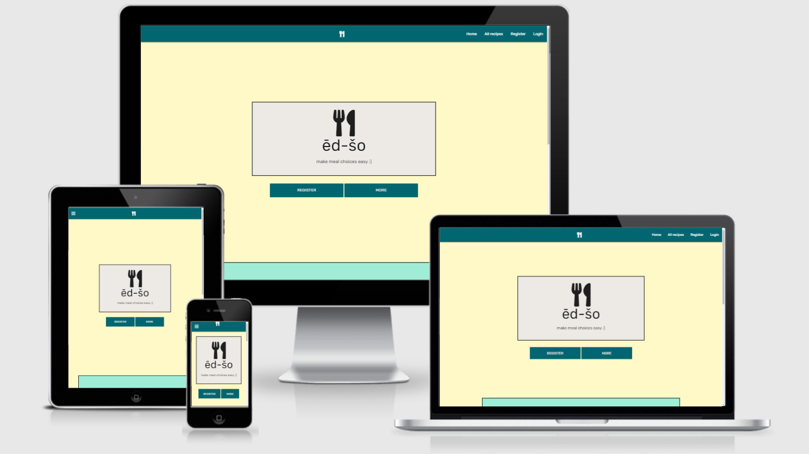

# MILESTON PROJECT 3 - ēd šo

[Live project](https://ed-so-msp3.herokuapp.com/)

## CONTENT
- [Overview](#overview)
- [User Experience](#user-experience)
    * [Project goals](#project-goals)
    * [User stories](#user-stories)
- [The 5 Planes](#the-5-planes)
    * [Strategy](#strategy)
    * [Scope](#scope)
    * [Structure](#structure)
    * [Skeleton](#skeleton)
    * [Surface](#surface)
- [Features](#features)
    * [Existing features](#existing-features)
    * [Future features](#future-features)
- [Technologies used](#technologies-used)
- [Testing](#testing)
    * [Code validation](#code-validation)
    * [User stories testing](#user-stories-testing)
    * [Cross platform testing](#cross-platform-testing)
    * [Bugs and fixes](#bugs-and-fixes)
- [Deployment](#deployment)
- [Credits](#credits)
    * [Conent](#content)
    * [Media](#media)
    * [Recipes](#recipes)
- [Acknowledgement](#acknowledgement)
- [Disclaimer](#disclaimer)
    

## **OVERVIEW**
A study by Colin Camera from Caltech (https://www.caltech.edu/about/news/scientists-uncover-why-you-cant-decide-what-order-lunch-83881) found interesting results for humans with their decision when given a list of options. They found brain activity in the anterior cingulate cortex (ACC) and the striatum to be most active via an fMRI scan in an study where groups of participants were given different number of choices to choose from. From the results, Camera estimated that humans ideal number of choices will range from 8-15 depending on the type of choices.  

Caltech have asked me to create an app/website that will help people make decision on what to cook by giving them a list of recipes.  

## **USER EXPERIENCE**
### **Project goals**
* To make a website where the user will be able to use a CRUD (create, read, update, and delete) function in the form of recipes 
* The website must encourage the user to use the website again via its content (mainly recipes), appearance and ease of navigation

### User stories
* first time visitor goals:
    * As a first time visitor, I want to be able to easily find and see a host of recipes 
    * As a first time visitor, visuals and design of the website must entice me to explore the website 
    * As a first time visitor, I want to see details of the selected recipe in an easy to view layout 
    * As a first time visitor, I should be acknowledged of any dietary elements to the recipe such as meat-free 
* Returning visitor goals 
    * As a returning visitor, I want to be able to know which recipes I have made 
    * As a returning visitor, I want to be given suggestions of which recipes to cook 
    * As a returning visitor, I want to be able to add to the host of recipes with my own recipes 
    * As a returning visitor, I want to be able to edit and delete my entries 
    * As a returning visitor, I want to search for recipes and even the poster/other users 
* Frequent visitor goals 
    * As a frequent visitor, I want to save recipes for later viewings 
    * As a frequent visitor, I want to see more and more recipes added to the database 
* Admin goals 
    * As an admin, I want to maintain the website 
    * As an admin, I want to to have the option to delete certain recipes and members 

## THE 5 PLANES
### Strategy 
* Purpose of website? To be a given a database of recipes so they can choose and cook. 
* Target audience? Young adults to mature/elderly adults, and especially those that enjoy cooking 
* Value to the user? Takes away the difficultness of deciding what to eat and makes it a fun way to choose what to eat 
* What will make a good experience? A clean appearance, ability to contribute to an online community, and easy access to sections 
* How are we different? We tell them what they can possibly cook via a short list instead of giving them a database of recipes which they will possibly be overloaded with choices to the point of being put off and cook their usual meal or order a takeaway 
* What we should not do? Simplicity is very much a strong part of the app/website in terms of how we give them a short menu/choices of what to cook; other parts of the website should also follow suite such as the appearance and navigation 

### Scope 
Intended features: 
* A page showing up to 8 recipes for the user to choose from 
* Ability to add, deletes, and edit recipes to add to the host of recipes 
* A profile page showing the users previous made recipes, their contributions and to delete their account 
Content: 
* Simple appearance  
* Engaging writing 

### Structure
A non-linear structure/navigation will be used as there will be a few links. The host of recipes will be the main reason as it will not nice for the viewer to see every recipe; with all its details, in a nonlinear structure.

Interaction design:  
* The layout of the website must be consistent for ease of learning and using of the website which includes colour and visual content (e.g. All forms must have curved edges and with a pink background). 
* Error pages should be made which will be much more visually and mentally pleasant than the default browsers default page. Have it lead to a the home page or a relevant page. 

Information architecture:
* [Sitemap](readme_files/images/sitemmap.png)
* [Database](readme_files/images/database.png)

### Skeleton
Laptop/PC Version
* Black and white
    * Home page - [image](readme_files/images/home_page_top.png) [image](readme_files/images/home_page_bottom.png)
    * Login page - [image](readme_files/images/login_page.png)
    * Register page - [image](readme_files/images/register_page.png)
    * Profile page - [image](readme_files/images/profile.png)
    * All recipes page - [image](readme_files/images/all_recipes.png)
    * Random recipes page - [image](readme_files/images/random_recipes_page.png)
    * My recipes page - [image](readme_files/images/my_recipes.png)
    * Edit recipe page - [image](readme_files/images/edit_recipe_page.png)
    * Add recipe page - [image](readme_files/images/add_recipe_page.png)

Mobile Version
* Black and white
    * Home page - [image](readme_files/images/home_page_mobile_mobile.png) [image](readme_files/images/home_page_bottom_mobile.png)
    * Login page - [image](readme_files/images/login_page_mobile.png)
    * Register page - [image](readme_files/images/register_page_mobile.png)
    * Profile page - [image](readme_files/images/profile_page_mobile.png)
    * All recipes page - [image](readme_files/images/all_recipes_page_mobile.png)
    * Random recipes page - [image](readme_files/images/random_recipes_page_mobile.png)
    * My recipes page - [image](readme_files/images/my_recipes_page_mobile.png)
    * Edit recipe page - [image](readme_files/images/edit_recipe_page_mobile.png)
    * Add recipe page - [image](readme_files/images/add_recipe_page_mobile.png)

### Surface
Colour scheme:
* A shade of dark turqiouse - #026670/rgb(2, 102, 112)
* A shade of light turqiouse - #9FEDD7159, 237, 215)
* A shade of light cream - #FEF9C7/rgb(254, 249, 199)
* A shade of pale yellow - #FCE181/rgb(252, 225, 129)
* A very light shade of cream - #EDEAE5/rgb(237, 234, 229)

Font:
* Main headings - [link](https://fonts.google.com/specimen/Rubik#standard-styles)
* Regular text - Montserrat - [link](https://fonts.google.com/specimen/Montserrat?query=montserrat)

## FEATURES
### Existing features 
* Header tag of .html files will contain the navbar. This navbar will include the website logo which when clicked, will direct the user to the home page. It will also contain the links to different parts of the website. Which links to appear will depend on whether the user is logged in or not 
* Footer tag of .html files will contain links to the websites social-media pages. Due to the nature of this project, the links will take the user to the social media home page; there will be no social media accounts for this website. 
* Home page (home.html) will consist of the website logo and slogan in the middle of the page. Underneath that will contain buttons leading to the registration page and further down the home page. Underneath this area will be another part of the home page which will contain information on how the website works. 
* Login page (login.html) will contain a form for the user to fill out in order to gain access to parts of the websites that is not the ‘home’, ‘register’ and a limited ‘all recipes’ page. Completing this form will lead the user to their very own ‘profile’ page. 
* Register page (register.html) will contain a form for the user to log back in the website. This will lead the user to the ‘profile’ page. 
* Profile page (profile.html) will contain a welcome message, information regarding the users username, registration date and how many recipes the user has uploaded. From this website, the links to more parts of the website will be accessible.  
* All recipes page (all_recipes.html) will contain all the recipes in the websites database. It will be displayed via an image and its title. Clicking on the title will lead the user another page (chosen_recipe.html) containing more information on the recipe. 
* Chosen recipe page (chosen_recipe.html) will contain a picture of the recipe, the name, description, ingredients, instructions and further details such as name of the user who posted it, timings of making the recipe, how many people it can feed and the amount of likes it has received. 
* Random recipes page (random_recipes.html) will contain three recipes from the database chosen at random 
* Logout link will log the user out 
* Remove link will remove the user from the database and all their recipes that they have posted. It will ask via  a modal whether they are sure they want this to happen. 
* Edit Recipe page (edit_recipe.html) will let the user edit their own recipes. This will button will only appear on the users recipes when on the selected recipes ‘chosen recipe’ page 
* Delete button will let the user delete their chosen recipe. It will ask via a modal whether they are sure they want this to happen. 

### Future features 
* A logo that is not a icon from fontawsome.com
* To be able to display recipes in specefic orders such as by name, name of poster etc
* Adding a favourite/save for later section
* A pagination might be useful once the website becomes popular and hundreds, thousands or millions of recipes are added to the database
* Improve upon sizing of images in the reciep cards; make them more uniform

## TECHNOLOGIES USED
* HTML
* CSS
* Jquery - a lightweight JavaScript library
* Python - back-end programming language
* Materialize - a .css library which also includes use of .js
* MongoDB - Cloud based service focused on database management
* Font awesome - a catalogue of icons for .html files
* Flask - framework for use of making a website
* Jinja - a template for use of python in .html
* Werkzeug - useful for keeping data safe such as passwords
* Jquery - A convenient JS library
* Github - Save and deploy projects useing this
* Git pod - Platform to write code
* Balsamiq - software for use fo making skeleton sketches
* Paint 3D - an app I used to help resize and edit images; It is available on Windows 10
* Lucid chart - website where you can make flowcharts
* W3C Markup Validator - detects any errors in .html files
* W3C CSS Validator - detects any errors in .css files

## TESTING
### Code validation
[HTML Validator](https://validator.w3.org/)
File | Results 1 | Corrections (if needed) | Notes
--- | --- | --- | --- |
base.html | [image1](readme_files/images/base_html_validation_before_p1.png), [image2](readme_files/images/base_html_validation_before_p1.png)
add_recipe.html | [image1](readme_files/images/add_recipe_html_validation_before_p1.png) | [image1](readme_files/images/add_recipe_html_validation_after_p1.png) | Mentioned pattern for 'image url' should not have a 'pattern'. Did not follow advice at it is needed
all_recipes.html | [image1](readme_files/images/all_recipes_html_validation_before_p1.png)
ban.html | [image1](readme_files/images/ban_html_validation_before_p1.png) | [image1](readme_files/images/ban_html_validation_after_p1.png)
chosen_recipe.html | [image1](readme_files/images/chosen_recipe_html_validation_before_p1.png), [image2](readme_files/images/chosen_recipe_html_validation_before_p2.png)
edit_recipe.html | [image1](readme_files/images/edit_recipe_html_validation_before_p1.png) | [image1](readme_files/images/edit_recipe_html_validation_after_p1.png) | Mentioned pattern for 'image url' should not have a 'pattern'. Did not follow advice at it is needed
error401.html | [image1](readme_files/images/error401_html_validation_before_p1.png)
error404.html | [image1](readme_files/images/error404_html_validation_before_p1.png)
home.html [image1](readme_files/images/home_html_validation_before_p1.png)
login.html | [image1](readme_files/images/login_html_validation_before_p1.png) | [image1](readme_files/images/login_html_validation_after_p1.png)
my_recipes.html | [image1](readme_files/images/my_recipes_html_validation_before_p1.png) | [image1](readme_files/images/my_recipes_html_validation_after_p1.png)
profile.html | [image1](readme_files/images/profile_html_validation_before_p1.png)
random_recipes.html | [image1](readme_files/images/random_recipes_html_validation_before_p1.png)
register.html | [image1](readme_files/images/register_html_validation_before_p1.png) | [image1](readme_files/images/register_html_validation_after_p1.png)

[CSS Validator](https://jigsaw.w3.org/css-validator/)
[image1](readme_files/images/style_css_validation.png) - no errors found

[PEP8 Validator](http://pep8online.com/)
[image1](readme_files/images/app_py_pep8_validation_before.png) - non PEP8 compliant
[image2](readme_files/images/app_py_pep8_validation_after.png) - now PEP8 compliant

### User stories testing
AIM | Achieved?
--- | --- |
As a first time visitor, I want to be able to easily find and see a host of recipes | yes
As a first time visitor, visuals and design of the website must entice me to explore the website | yes 
As a first time visitor, I want to see details of the selected recipe in an easy to view layout | yes 
As a first time visitor, I should be acknowledged of any dietary elements to the recipe such as meat-free | no 
As a returning visitor, I want to be able to know which recipes I have made  | yes 
As a returning visitor, I want to be given suggestions of which recipes to cook  | yes 
As a returning visitor, I want to be able to add to the host of recipes with my own recipes  | yes 
As a returning visitor, I want to be able to edit and delete my entries  | yes 
As a returning visitor, I want to search for recipes and even the poster/other users  | yes 
As a frequent visitor, I want to save recipes for later viewings  | no
As a frequent visitor, I want to see more and more recipes added to the database  | yes 
As an admin, I want to maintain the website  | yes
As an admin, I want to to have the option to delete certain recipes and members | yes

### Cross platform testing
## CRUD (create, read, update, and delete) testing
AIM | Mobile | Tablet | Laptop | Large monitor
--- | --- | --- | --- | --- |
Can a user create a recipe? | yes  | yes | yes
Can a user read/view a recipe? | yes | yes | yes
Can a user update a recipe? | yes | yes | yes
Can a user delete a recipe? | yes | yes | yes

## Home page testing (home.html)
AIM | Mobile | Tablet | Laptop/PC monitor (Google Chrome)
--- | --- | --- | --- |
Any user clicking on 'more' button will lead to a smoothe scrolldown to the 'how it works' section of the homepage | yes | yes | yes
Any user clicking on either 'register' buttons will lead to the register.html | yes | yes | yes
Any user clicking on 'login' button will lead to login.html | yes | yes | yes
'register' button will not appear when a user is logged in | yes | yes | yes

## Navbar testing (base.html)
AIM | Mobile | Tablet | Laptop/PC monitor (Google Chrome)
--- | --- | --- | --- |
Clicking on the logo will lead user to the home.html | yes | yes | yes
When user is not logged in, only link that will appear will be 'Home', 'All recipes', 'Login', and 'Register' | yes | yes | yes
When user is logged in, the links on show will be 'Home, 'All recipes', 'Random', 'Profile', and 'Logout' | yes | yes | yes
Clicking on 'logout' will lof the user out if his/her account and back to home.html | yes | yes | yes
If log out is successful, a flash should appear with the text "You have logged out" | yes | yes | yes

## Register testing (register.html)
AIM | Mobile | Tablet | Laptop/PC monitor (Google Chrome)
--- | --- | --- | --- |
'username' will only take in aplabetical characters(upper and lower case) and numbers | yes | yes | yes
'username' will only take upto 20 characters | yes | yes | yes
'username' will take a minimum of 5 characters | yes | yes | yes
'password' will only take in aplabetical characters(upper and lower case) and numbers | yes | yes | yes
'password' will take a minimum of 5 characters | yes | yes | yes
'password' will only take upto 20 characters | yes | yes | yes
Clicking on 'login from here' will take the user to the login.html | yes | yes | yes
Clicking on 'sign up' will update the intended mongo database (mongo.db.users) | yes | yes | yes
Clicking on 'sing up' will also taek the user to their profile page (profile.html) | yes | yes | yes

## Login testing (login.html)
AIM | Mobile | Tablet | Laptop/PC monitor (Google Chrome)
--- | --- | --- | --- |
'username' will only take in aplabetical characters(upper and lower case) and numbers | yes | yes | yes
'username' will only take upto 20 characters | yes | yes | yes
'username' will take a minimum of 5 characters | yes | yes | yes
'password' will only take in aplabetical characters(upper and lower case) and numbers | yes | yes | yes
'password' will take a minimum of 5 characters | yes | yes | yes
'password' will only take upto 20 characters | yes | yes | yes
Clicking on 'register from here' will take the user to the login.html | yes | yes | yes
Clicking on 'login' will also take the user to their profile page (profile.html) if successful | yes | yes | yes
If clicking on 'login' and app.py did not find a match in the details entered, a flash message of "Username and/or password is incorrect" will appear | yes | yes | yes
If clicking on 'login' and app.py did not find a match in the details entered, details entered will be cleared from the form | yes | yes | yes

## Profile testing (profile.html)
AIM | Mobile | Tablet | Laptop/PC monitor (Google Chrome)
--- | --- | --- | --- |
Username of the user will appear near the top of the page | yes | yes | yes
Buttons of 'Add', 'Mine', 'Random' and 'Bye' will appear on screen | yes | yes | yes
Clicking on 'add' will take user to the add_recipe.html | yes | yes | yes
Clicking on 'mine' will take user to the my_recipes.html | yes | yes | yes
Clicking on 'random' will take user to the random_recipes.html | yes | yes | yes
Clicking on 'bye' will lead to a modal appearing | yes | yes | yes
The modal will ask 'Delete?' with a follow message 'Clicking yes will permanently delete your account and all your recipes' | yes | yes | yes
Clicking on 'no' will remove the modal | yes | yes | yes
Clicking on 'yes' will delete the user from the intended monog database (mongo.db.users) | yes | yes | yes
Clicking on 'yes' will also lead the user back to the home.html | yes | yes | yes
A flash message of "You are no longer one of us" should appear | yes | yes | yes
A card of the most popular recipe based on the ammount of likes will also be on show | yes | yes | yes

## All recipes testing (all_recipes.html)
AIM | Mobile | Tablet | Laptop/PC monitor (Google Chrome)
--- | --- | --- | --- |
A host of cards should appear containing a picture, title, information regarding likes, servings, and cooking duration from the mongo database (mongo.db.recipes) | yes | yes | yes
Quantity of cards on show will match the quantity of entries in the mongo database that it is coming from | yes | yes | yes
There should be three cards on each row for large+ sized screen | n/a | n/a  | yes
There should be two cards on each row for medium sized screen | n/a | yes | n/a
There should be one card on each row in a small sized screen | yes | n/a | n/a
Clicking on the up-arrow icon should lead to another card sliding up contained the name of the recipe and the description | yes | yes | yes
Clicking on the down-arrow icon when the sliding happens should slide it back down | yes | yes | yes
'lets make this' should not be visible if the user is not logged in | yes | yes | yes
If logged in, 'lets make this' should be visible | yes | yes | yes
Clicking on 'lets make this' will lead teh user to chosen_recipe.html with detials of the chosen card | yes | yes | yes

## Chosen recipes (chosen_recipe.html)
AIM | Mobile | Tablet | Laptop/PC monitor (Google Chrome)
--- | --- | --- | --- |
Image of recipe should be near the top | yes | yes | yes
Recipe name, username, creation date, likes, servings, cooking curation, and recipe description should appear near the upper right of the screen if on a large+ sized screen | n/a | n/a | yes
If nothing has been entered for the recipes image url, a [default image](static/images/default_recipe_image.jpg) should appear | yes  | yes | yes
Recipe name, username, creation date, likes, servings, cooking curation, and recipe description should appear one below the other in that order on a medium- sized screen | yes  | yes | n/a
Clicking on the 'like' icon (heart) will increment the number below it by 1 | yes | yes | yes
Recipe ingredients list should appear near the lower left of the screen on a large+ sized screen | n/a | n/a | yes
Recipe instructions list should appear near the lower right of the screen on a large+ sized screen | n/a | n/a | yes
Recipe ingredints will appear in an unordered list format | yes | yes | yes
Recipe instructions will appear in an ordered list format | yes | yes | yes
Bottom corner of the screen should have a 'plus' icon if the recipes was posted by the user logged in | yes | yes | yes
Hovering on the 'plus' icon will lead to the icons of 'delete' and 'edit' to appear if on a large+ sized screen | n/a | n/a | yes
Clicking on the 'plus' icon will lead to the icons of 'delete' and 'edit' to appear if on a medium+ sized screen | yes | yes | n/a
Clicking on the 'edit' icon will lead user to the edit_recipe.html | yes | yes | yes
Clicking on 'delete' icon will lead to a modal appearing | yes | yes | yes
The modal will ask 'Delete?' with a follow message 'Clicking yes will permanently delete this recipe' | yes | yes | yes
Clicking on 'no' will remove the modal | yes | yes | yes
Clicking on 'yes' will delete the recipe from the intended monog database (mongo.db.recipes) | yes | yes | yes
clicking on 'yes' will also lead the user back to the all_recipes.html | yes | yes | yes

## Edit recipe
AIM | Mobile | Tablet | Laptop/PC monitor (Google Chrome)
--- | --- | --- | --- |
Each field on the form should match the information on the mongo databse of the recipe chosen to edit | yes | yes | yes
Clicking on any field should give the user the ability to change the inputs | yes | yes | yes
Clicking on 'edit' will update the informatino of that recipe in the mongo database | yes | yes | yes
Clicking on 'edit' will also then lead the user to the all_recipes.html | yes | yes | yes
Changed information of edited recipe should be visible in ohter pages the recipe appears in (all_recipes.html, chosen_recipes.html, and my_recipes.html) | yes | yes | yes

## Add recipe testing (add_recipe.html)
AIM | Mobile | Tablet | Laptop/PC monitor (Google Chrome)
--- | --- | --- | --- |
'recipe name' field should take in any characters | yes | yes | yes
'recipe name' will take upto 100 characters in length | yes | yes | yes
'recipe description' field will take in any characters | yes | yes | yes
'recipe description' field size should accomodate the entered information | yes | yes | yes
'recipe ingredients' field will take in any characters | yes | yes | yes
'recipe ingredients' field size should accomodate the entered information | yes | yes | yes
'recipe instructions' field will take in any characters | yes | yes | yes
'recipe instructions' field size should accomodate the entered information | yes | yes | yes
'recipe image url' field will take in url text | yes | yes | yes
'recipe image url' field size should accomodate the entered information | yes | yes | yes
'recipe image url' is not a required field | yes | yes | yes
'servings' will only take in numbers | yes | yes | yes
'servings' will take in a number of maximum of 2 digits long | yes | yes | yes
'servings' will take in a number of minimum of 1 digit | yes | yes | yes | yes
'duration' will only take in numbers | yes | yes | yes
'duration' will take in a number of maximum of 3 digits long | yes | yes | yes
'duration' will take in a number of minimum of 1 digit | yes | yes | yes
Clicking on 'share' will update the relevant mongo database | yes | yes | yes
Clicking on 'share' will also lead teh user to the all_recipes.html | yes | yes | yes
Flash message of "Recipe has been added" should appear | yes | yes | yes

## Edit recipe testing (edit_recipe.html)
AIM | Mobile | Tablet | Laptop/PC monitor (Google Chrome)
--- | --- | --- | --- |
All fields should be prefilled witht he details of the chosen recipe to edit | yes | yes | yes
Clicking on the 'edit' button should update the details of that recipe on the mongo database with the new/edited details | yes | yes | yes
Clicking on the 'edit' button should lead the user to the my_recipe.html | yes | yes | yes
Flash message of "Recipe hsa been updated" should appear | yes | yes | yes

## My recipes testing
AIM | Mobile | Tablet | Laptop/PC monitor (Google Chrome)
--- | --- | --- | --- |
All recipe cards on show will be recipes posted by the user | yes | yes | yes
There should be three cards on each row for large+ sized screen | n/a | n/a  | yes
There should be two cards on each row in a medium sized screen | yes | yes | n/a
There should be one card on each row in a small- sized screen | yes | n/a | n/a

## Random recipes testing
AIM | Mobile | Tablet | Laptop/PC monitor (Google Chrome)
--- | --- | --- | --- |
Three cards will be on show | yes | yes | yes
There should be three cards on each row for large+ sized screen | n/a | n/a  | yes
There should be one card on each row in a medium- sized screen | yes | yes | n/a
Recipe cards will change each time random.html is clicked | yes | yes | yes

## Admin testing
AIM | Mobile | Tablet | Laptop/PC monitor (Google Chrome)
--- | --- | --- | --- |
Ability to edit any recipe | yes | yes | yes
Ability to delete any recipe | yes | yes | yes
'bye' button will not be visible in profile.html | yes | yes | yes
'ban' button will be visible in profile.html | yes | yes | yes
On ban.html, entered user will be deleted from teh mongo database | yes | yes | yes
The deleted user will also have all theri recipes deleted from the mongo database | yes | yes | yes
A flash message of "that chef has been fired" should appear | yes | yes | yes
A flash message of "user does not exist" should appear if user does not exist | yes | yes | yes
The form should be cleared of previous entry | yes | yes | yes

## Security testing
AIM | Mobile | Tablet | Laptop/PC monitor (Google Chrome)
--- | --- | --- | --- |
When logging out, session cookie of user will be deleted | yes | yes | yes
If session cookie of the user is not in storage when navigating to the profile.html, page will lead to the error401.html | yes | yes | yes
If session cookie of the user does not match the user in the url, page will lead to the error401.html | yes | yes | yes
If session cookie of the user is not in storage when navigating to the all_recipes.html, page will load up the same way as non logged in user would see it | yes | yes | yes
If session cookie of the user is not in storage when navigating to the random_recipes.html, page will lead to the error404.html | yes | yes | yes
If session cookie of the user is not in storage when navigating to the my_recipes.html, page will lead to the error401.html | yes | yes | yes
If session cookie of the user is not in storage when navigating to the chosen_recipe.html, page will lead to the error401.html | yes | yes | yes
If session cookie of the user is not in storage when navigating to the chosen_recipe.html, page will lead to the error401.html | yes | yes | yes
If session cookie of the user is not in storage when navigating to the edit_recipe.html, page will lead to the error401.html | yes | yes | yes
If session cookie of the user is not in storage when clicking 'edit' on the edit_recipe.html, page will lead to the error404.html | yes | yes | yes
If details of the session cookie of the user does not match the chosen recipe for editing, page will lead to the error401.html | yes | yes | yes
If session cookie of the user is not in storage when navigating to the add_recipe.html, page will lead to the error401.html | yes | yes | yes
If session cookie of the user is not in storage when clicking 'share' on the edit_recipe.html, page will lead to the error404.html | yes | yes | yes
If session cookie of the user is not in storage when clicking 'bye' > 'yes' in the profile.html, page will lead to the error404.html | yes | yes | yes
Relevant MongoDB database will not be updated when this happens | yes | yes | yes
If session cookie of the admin is not in storage when clicking 'ban' > 'yes' in the ban.html, page will lead to the error404.html | yes | yes | yes

### Bugs and fixes
Problem | Solved? | How?
--- | --- | --- |
grid system for the 'How it works' section in the home.html was not working as expected on screen sizes of l+ - [image 1](readme_files/images/grid_misalignment_issue.png) [image 2](readme_files/images/grid_misalignment_issue_code.png) | YES | I included a border around each div which contained .col, .s12, m6, l6. For whatever reason, this solved the problem. I came upon this solution with my suspicion that padding and/or margin might be the issue. I created a border to check the width of the div and to my great fortune, this solved the issue. [image](readme_files/images/grid_misalignment_issue_solved.png)

## DEPLOYMENT
### Making A Local Clone
You may want to have access via a copy of the repository on your own device. There are three ways to do this: 
* Method 1
1. Login to your GitHub account and open up the repository you would like to copy 
2. Click on the button with a drop-down menu named ‘Code’ which will be placed next to the green ‘Gitpod’ button
3. You will then have the option to download it on to your system via the ‘Download ZIP’ option

* Method 2 
1. Open up your preferred IDE and open up the folder where you would the repository to be copied/cloned
2. In the terminal, type in ‘git clone’ ; do not press enter or anything else
3. Now login to your GitHub account and open up the repository you would like to copy
4. Click on the ‘Code’ button again and copy the text given under the subheading ‘HTTPS’. A button next to this text gives you an easier way of copying the text
5. Back to your IDE terminal, after the ‘git clone’, press the spacebar button and paste in the link you copied from the repository. Your entry in the terminal should look something like this: ‘gti clone https://github.com/shiba517/ed_so-MSP3.git’. Then press enter
6. Your terminal will let you know the repository has been cloned and saved to your preferred destination and will be evident when viewing files and folders from your preferred destination

### Setting project up with MongoDB
1. Log into your MongoDB account and open up your prefered cluster
2. From your prefered cluster page, click on the 'COLLECTIONS' button
3. A new databse will need to be built. Click on 'Create Databse', fill out the fields and click 'Create'
    * To create more collections, click on the 'CREATE COLLECTION' button
    * clicking on the name of any of the collections you made, you can add keys and value pairs by clicking on the 'INSERT DOCUMENT' button

### Deploying to Heroku
1. Int your chosen IDE, create an env.py file
    * type in the following (minus the * sign):
        * Import os
        * os.environ.setdefault("IP", "0.0.0.0")
        * os.environ.setdefault("PORT", "5000")
        * os.environ.setdefault("SECRET_KEY", "(enter in a password")
        * os.environ.setdefault("MONGO_URI", "")
        * os.environ.setdefault("MONGO_DBNAME", "(name of your collection)")
    * Create a .gitignore file and type in (without the quotation marks) "env.py"
1. In the terminal, type in (without the quotation marks) "pip3 freeze --local > requirements.txt"
2. In the termianl, now type in "echo web: python app.py > Procfile"
    * New files will appear under the name of 'requirements.txt' and 'Procfile'
    * In the 'Procfile', if you notice a blank line at the end (usually line 2), delete it
3. Noe login into your Heroku and create a new app
    1. Under the 'Deploy' tab, connect to Github by clicking on Github and connect it to you repository
    2. Now go to the 'Setting' tab and lcik on 'Reveal Convig Vars'
    3. Enter details of your env.py file here
    4. Back on your terminal, push all changes made
    5. In teh 'settings' tab of your heroku account, click on 'Enable Automatic Deploys'; It should now be read as 'Disable Automatic Deploys'
    6. Now clik on 'Deploy Branch'. Heroku will now connect with Github to create your app
    7. When that is complete, you can view your new app by clicking on the bewly appeared button, 'View'
4. Everytime you want your code to be on the app, you can finalise that by pushing all changes via your terminal in your Github IDE
5. When you log back in to your Heroku account and open up the file of your project, a button in corner named 'Open app' will open your app

## CREDITS
### Content
* Inpsiration for the fictional story of the aim of the making of the website, written in the Overview section, was inspired by an article found on caltech.edu - [link](https://www.caltech.edu/about/news/scientists-uncover-why-you-cant-decide-what-order-lunch-83881)
* All written content; except for the written content on the recipe cards, was written by me

### Media
* Colour scheme (#50) by **Five Hundred** - https://visme.co/blog/website-color-schemes/
* Typography for headings by **Johan Aukerlund** - https://fonts.google.com/specimen/Rubik#standard-styles 
* Typography for non-headings by **Julieta Ulanovsky, Sol Matas, Juan Pablo del Peral, Jacques Le Bailly** - https://fonts.google.com/specimen/Montserrat?query=montserrat
* Illustration by **Freepic.com** via **Flaticon** - https://www.flaticon.com/authors/kawaii/lineal-color
    * [question.png](https://www.flaticon.com/free-icon/question_5696601)
    * [cook.png](https://www.flaticon.com/free-icon/baker_817282?term=chef&page=1&position=33&page=1&position=33&related_id=817282&origin=search)
    * [sharing.png](https://www.flaticon.com/free-icon/sharing_1721682)
    * [social-media](https://www.flaticon.com/free-icon/social-media_4841173)
* Default image for recipe card by **Lily Banse** via [unsplash.com](https://unsplash.com/) - https://unsplash.com/photos/-YHSwy6uqvk

### Recipes
For experimenting and testing of the website, I used the recipes on [BBC Good Food webite](https://www.bbcgoodfood.com/). Below is a list of the links to the recipes I used which also inlcudes the images
* [Slow cooker chilli con carne](https://www.bbcgoodfood.com/recipes/slow-cooker-chilli-con-carne) by **Esther Clark**
* [Caponata pasta](https://www.bbcgoodfood.com/recipes/caponata-pasta) by **Cassie Best**
* [Coconut & squash dhansak](https://www.bbcgoodfood.com/recipes/coconut-squash-dhansak) by **Cassie Best**
* [Vegetarian fajitas](https://www.bbcgoodfood.com/recipes/veggie-fajitas) by **Lulu Grimes**
* [Chorizo & mozzarella gnocchi bake](https://www.bbcgoodfood.com/recipes/chorizo-mozzarella-gnocchi-bake) by **Marianne Turner**
* [Creamy salmon, leek & potato traybake](https://www.bbcgoodfood.com/recipes/creamy-salmon-leek-potato-traybake) by **Esther Clark**
* [Tomato & mascarpone risotto](https://www.bbcgoodfood.com/recipes/tomato-mascarpone-risotto) by **Esther Clark**
* [Healthy mushroom soup](https://www.bbcgoodfood.com/recipes/russian-wild-mushroom-barley-soup) by **Diana Henry**
* [Pasta e fagioli](https://www.bbcgoodfood.com/recipes/pasta-e-fagioli) by **Myles Williamson**
* [Lentil soup](https://www.bbcgoodfood.com/recipes/lentil-soup) by **Member recipe by bevieevey**

## ACKNOWLEDGEMENT
* Course tutor Precious Ijege
* [Code Institue course](https://codeinstitute.net/)
* [Web Dev Simplified](https://www.youtube.com/watch?v=ofme2o29ngU&t=606s)
* [W3Schools](https://www.w3schools.com/python/)

## Disclaimer
This project is for a project set to me by Code Institute, a coding course that I have enrolled in. If any issues occur regarding anything to this project, please feel free to contact me (shiba.cdeb@gmail.com)